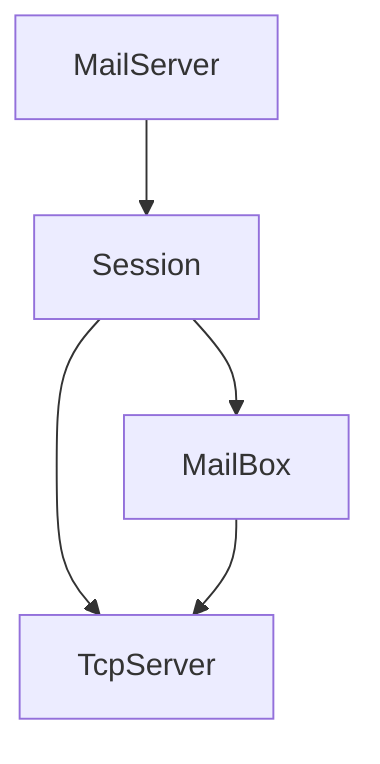

# AlIM
Simple golang IM

## 初步需求
* 私聊
* 群聊

## 结构
* 连接层：负责维护长连接，消息收发
* 业务层：根据不同消息类型，连接不同Handler，适时消息推送/拉取
* 存储层：缓存ToT，要加的话放进GetXXX逻辑中

### Intro
* 负责提供连接请求，每建立一个连接起一个goroutine初始化Session  
* Session：Session创建后，客户端发送连接请求，初始化用户，并获取MailBox  
* MailBox：广播信箱，所有订阅信箱的Session将会通过TcpServer向用户发送信息  
* TcpServer：负责消息体的定义，上层只需要使用message发送、接收

## 实现
群聊与私聊均使用Mailbox进行
1. 群聊：向所属群组进行广播
    * 使用Mailbox，将用户添加进广播用户中，当发送消息时，直接使用Mailbox群组广播
2. 私聊：寻找接收方群组直接广播
    * 为每个用户绑定个人Mailbox，个人Mailbox不允许其他用户添加进群组。

建立连接：
    获取第一个连接信息，初始化
   
添加好友：暂定
    建立UserMap，当用户存在映射关系认为双方存在好友
    好友请求向个人邮箱发送，发送后返回认为通过好友请求
已读未读
