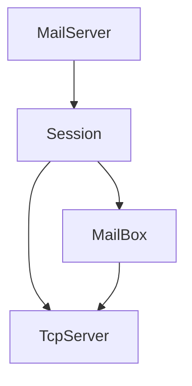

# AlIM
Simple golang IM

## 初步需求
* 私聊
* 群聊

## 结构
* 连接层：负责维护长连接，消息收发
* 业务层：根据不同消息类型，连接不同Handler，适时消息推送/拉取
* 存储层：缓存ToT

### Intro
* 负责提供连接请求，每建立一个连接起一个goroutine初始化Session  
* Session：Session创建后，客户端发送连接请求，初始化用户，并获取MailBox  
* MailBox：广播信箱，所有订阅信箱的Session将会通过TcpServer向用户发送信息  
* TcpServer：负责消息体的定义，上层只需要使用message发送、接收

## 实现
群聊与私聊均使用Mailbox进行
1. 群聊的实现就是Mailbox为注册的用户广播
2. 私聊的Mailbox只绑定在两个用户
    使用tag？来判断一个Mailbox是否是属于这两个用户的，判断后不允许连接