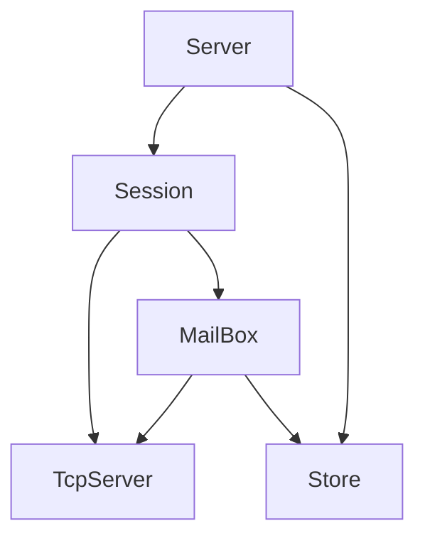

# AlIM
Simple golang IM

## 初步需求
* 私聊
  * 添加好友
* 群聊

## 结构
* 连接层：负责维护长连接，消息收发
* 业务层：根据不同消息类型，连接不同Handler，适时消息推送/拉取
* 存储层：缓存ToT，要加的话放进GetXXX逻辑中

### Intro
* 负责提供连接请求，每建立一个连接起一个goroutine初始化Session  
* Session：Session创建后，客户端发送连接请求，初始化用户，并获取MailBox  
* MailBox：广播信箱，所有订阅信箱的Session将会通过TcpServer向用户发送信息  
* TcpServer：负责消息体的定义，上层只需要使用message发送、接收

## 实现
群聊与私聊均使用Mailbox进行
1. 群聊：向所属群组进行广播
    * 使用Mailbox，将用户添加进广播用户中，当发送消息时，直接使用Mailbox群组广播
2. 私聊：寻找接收方群组直接广播
    * 为每个用户绑定个人Mailbox，个人Mailbox不允许其他用户添加进群组。
## 逻辑
1. 建立连接：
   * 包类型：`ConnectMessage`  
   * 设置`Session` Name、ID

2. 变更房间：（初次连接房间时也使用
    * 包类型：`RoomChangeMessage` 必须字段：RoomID、RoomType
    * 查看 当前房间是否存在，存在则删除监听  
    * 查看 连接房间是否存在

3. 发送消息：
    * 包类型：`SendMessage` 必须字段：Content
    * 向当前房间进行广播

4. 添加好友：
    * 包类型：`AddFriendMessage` 必须字段：RoomID(好友的UserID)  
    * 检查好友映射关系  
        - 有好友：直接查询`PrivateRooms`，有房间就说明对方添加过了，直接加入；没有就创建房间  
        - 没有好友：添加好友映射关系，并且新建房间  
